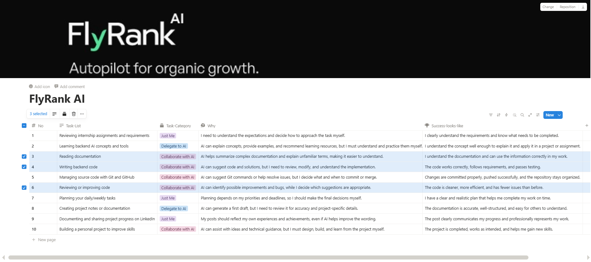

# Week 1 — Assignment 1

## 🧭 AI Workflow Audit & Tool Setup

### 🎯 Objective

The goal of this assignment was to analyze my weekly workflow and understand how AI can support different types of tasks — rather than assuming AI should be used everywhere, I focused on identifying **where it actually helps** and where it doesn't belong.

Specifically, figuring out where:

- 🧍 Human judgement is essential
- 👀 AI can assist, but I still review everything
- 🤝 AI works best as a collaborator
- ⚙️ Certain repetitive tasks can be safely automated

---

### ✅ What I Completed

- Analyzed my recurring weekly tasks (study, side projects, general work)
- Categorized each task based on how much AI should be involved
- Explained the reasoning behind each decision
- Defined what "successfully done" looks like for every task
- Set up a personalized AI workspace/project for future learning

---

### 📸 Workflow Audit

---

### 💡 Key Takeaways

- AI is most effective when used **intentionally**, not automatically
- Critical thinking still matters most — especially for engineering tasks
- Knowing *when* to use AI is just as important as knowing *how*
- Clearly defined workflows make collaborating with AI way more effective

---

### 🛠️ Skills Practiced

`Workflow Analysis` `AI Collaboration` `Critical Thinking` `Productivity Planning` `Prompt Awareness`

---

### 🪞 Reflection

This assignment helped me realize AI isn't a replacement for learning or problem-solving — it's a powerful assistant that can genuinely improve efficiency, but it still requires human judgement and responsibility to use well.

> This page reflects my own personal learning and reflections only.
