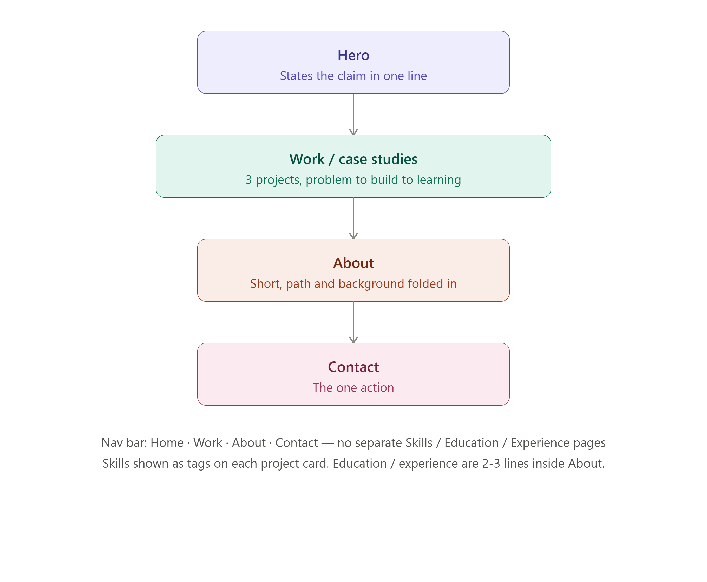

# 🗺️ Week 1 · Assignment 2 — Draw the Path: Portfolio Sitemap + Toolkit
 
> AI Fluency Course
 
---
 
## 🎯 Brief
 
Sketch a lean portfolio sitemap that walks one visitor from landing → believing you → taking one action, set up a free AI toolkit (Claude, ChatGPT, Gemini, Perplexity), configure a dedicated Claude Project with a proof statement and tutor instructions, and run one real prompt pressure-testing the sitemap against the claim and the one action.

---
 
## 📐 Initial Sitemap
 
<div align="center">

</div>

**Structure:**
```
Nav bar: Home · Work · About · Contact
(no separate Skills / Education / Experience pages)
```
 
| Section | Purpose |
|---|---|
| **Hero** | States the claim in one line |
| **Work / Case Studies** | 3 projects, problem → build → learning |
| **About** | Short, path and background folded in |
| **Contact** | The one action |
 
Skills shown as tags on each project card. Education/experience folded into About as 2-3 lines.
 
---
 
## 🤖 Claude Project Setup
 
- Created a dedicated **Claude Project** for this 8-week build
- Custom instructions configured with my proof statement pasted in, and a request to act as a tutor throughout the course

---
 
## 🔍 Pressure-Test Prompt & Output
 
**Prompt:** Pressure-test the sitemap above against my one action and my claim.
 
**Claude's response:**
 
> **Hero** — earns its place. One line stating the claim is right, but "junior backend developer building practical AI-powered features" does two jobs at once (role + specialization) — the hero should also signal what kind of role is wanted, so it isn't read as "only wants to work at an AI company" if that's not the intent.
>
> **Work/Case Studies** — earns its place as the main evidence. But for a junior candidate, "problem to build to learning" risks under-selling technical substance — hiring managers are mainly checking *can this person write production-reasonable backend code*, not *did they learn something*. Each case study should foreground technical decisions (why this DB, why this API shape, how AI integration handled latency/cost/failure modes), link to actual code, and stay honest about scope/scale.
>
> **About** — the section worth questioning hardest. Thin content (background + education + experience in 2-3 lines) might not need a full nav item — either fold it into Hero/Contact, or keep it separate only if it carries something Hero/Work can't, like logistics (location, availability, work authorization) that a hiring manager needs before reaching out.
>
> **Contact** — earns its place as the action, but shouldn't only be reachable at the end of the funnel — a persistent contact link/button reduces friction for hiring managers who skim and act fast.
>
> **Missing entirely:** a resume/CV link (the biggest gap — many hiring managers want this before or instead of a contact form), availability/logistics (start date, remote/onsite, visa status), a more prominent GitHub link, and a response-time expectation on Contact (e.g. "I usually respond within 24h").
>
> **Bottom line:** the structure is sound and appropriately minimal — the real gaps are content-level, not structural. Add a resume link and logistics info, and make sure About pulls its own weight or gets merged.
 
---
 
## ✅ What I Changed
 
After the pressure-test, I updated the sitemap to include a **visible Resume/CV download button plus GitHub and LinkedIn links directly in the Hero section** — so recruiters and professors can access my professional info immediately, without navigating through multiple sections.
 
### Revised Sitemap
 
```
Home
│
├── Hero
│   └── Resume Download + GitHub + LinkedIn buttons
│
├── Projects / Case Studies
│
├── About
│   ├── Short introduction
│   ├── Education
│   ├── Current internship
│   └── Career goal
│
└── Contact
```
 
---
 
## 📝 Notes / Reflection
 
- The one thing I'll change going forward: keep About lean and only load it with content Hero/Work genuinely can't carry — logistics and career goal, not a restatement of my background.
- Adding the resume/GitHub/LinkedIn cluster to Hero removes a click between a hiring manager and my proof — directly addresses the biggest gap flagged in the pressure-test.
